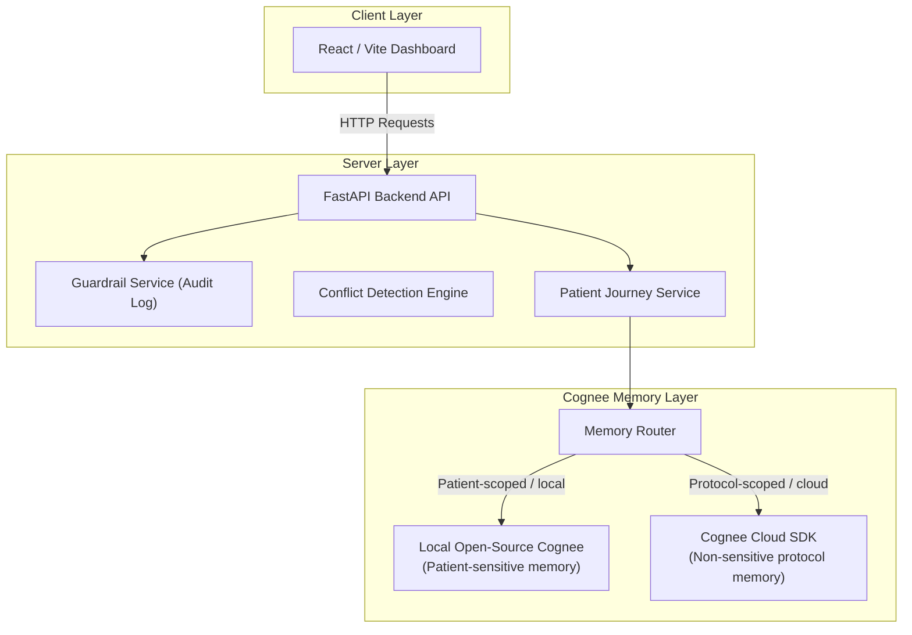

# 🩺 MedGraph

> **Every clinician gets the patient's full journey memory, without sending patient-sensitive data to the cloud.**

MedGraph is a privacy-first clinical context layer and hackathon MVP powered by a hybrid **Cognee** memory architecture. It tracks a synthetic patient's journey from ER intake through cardiology handoffs, pharmacy reviews, safety checks, and discharge.

By utilizing a smart routing split, **sensitive patient-scoped journey memory** stays locally on open-source Cognee, while **non-sensitive shared clinical protocols** are saved to Cognee Cloud for team-wide reuse.

---

## 🏗️ System Architecture

MedGraph connects a modern React dashboard to an asynchronous FastAPI backend which interfaces with local Cognee and Cognee Cloud.



---

## ✨ Key Features

- **End-to-End Journey Tracking**: Keeps a persistent record of the patient's movement across Emergency, Cardiology, and Pharmacy departments.
- **Privacy-Aware Hybrid Memory Routing**:
  - **Local Open-Source Cognee**: Stores sensitive timeline logs, clinician notes, and patient identifiers.
  - **Cognee Cloud**: Stores reusable, non-sensitive clinical protocol instructions.
- **Deterministic Conflict Detection**: Real-time evaluation of proposed actions (e.g. drug-allergy interactions, anticoagulant overlap, renal contraindications like metformin or CT contrast based on eGFR).
- **Safety Guardrails**: Policy gate filtering out prescriptive AI recommendations to ensure human-in-the-loop clinical supervision.
- **Visual Log Viewer**: An interactive panel displaying raw API payloads and execution statuses for `remember`, `recall`, `improve`, and `forget`.

---

## 📊 Cognee API Operations Mapping

MedGraph implements the complete Cognee memory lifecycle:

| Cognee Operation | Implementation Context | Storage Scope | API Route |
| :--- | :--- | :--- | :--- |
| **`remember`** | Stores patient events & protocol submissions | Local Patient DB + Cognee Cloud | `POST /patients/{id}/events`<br>`POST /memory/protocols/{id}` |
| **`recall`** | Generates clinician briefings & discharge summaries | Hybrid (Local + Cloud) | `GET /patients/{id}/briefing`<br>`GET /patients/{id}/discharge-summary` |
| **`improve`** | Refines memory graphs and vector search indexing | Local DB + Cognee Cloud | `POST /patients/{id}/memory/improve`<br>`POST /memory/protocols/{id}/improve` |
| **`forget`** | Purges patient records on discharge or reset | Local Patient DB | `DELETE /patients/{id}/memory`<br>`DELETE /memory/protocols/{id}` |

---

## 🛠️ Local Setup & Installation

### Prerequisites
- Python 3.10+
- Node.js 18+
- A Cognee Cloud account (optional, fallback JSON store active otherwise)

---

### 1. Backend Setup

1. Navigate to the backend directory:
   ```bash
   cd backend
   ```

2. Create a `.env` file using the configuration template below:
   ```env
   # Server Config
   APP_HOST=0.0.0.0
   APP_PORT=8000
   DEBUG=true

   # Cognee Configuration
   COGNEE_ENABLE_SDK=true
   COGNEE_ENABLE_CLOUD=true
   COGNEE_CLOUD_API_KEY=<your-cognee-cloud-key>
   COGNEE_CLOUD_BASE_URL=<your-cognee-tenant-url>

   # LLM & Embedding Settings (Aliyun Dashscope Example)
   LLM_API_KEY=<your-llm-key>
   LLM_API_BASE=https://dashscope.aliyuncs.com/compatible-mode/v1
   LLM_MODEL=qwen-max

   EMBEDDING_API_KEY=<your-embedding-key>
   EMBEDDING_API_BASE=https://dashscope.aliyuncs.com/compatible-mode/v1
   EMBEDDING_MODEL=text-embedding-v3

   ENABLE_BACKEND_ACCESS_CONTROL=false
   ```

3. Install dependencies and start the FastAPI server:
   ```bash
   python -m pip install -r requirements.txt
   python -m uvicorn backend.app:app --host 127.0.0.1 --port 8000
   ```

4. Verify backend status by accessing the Swagger UI at:
   👉 [http://127.0.0.1:8000/docs](http://127.0.0.1:8000/docs)

---

### 2. Frontend Setup

1. Navigate to the frontend directory:
   ```bash
   cd ../frontend
   ```

2. Copy the environment variables:
   ```bash
   cp .env.example .env
   ```

3. Install dependencies and start the Vite development server:
   ```bash
   npm install
   npm run dev -- --port 5174
   ```

4. Open your browser to the local app dashboard:
   👉 [http://127.0.0.1:5174/](http://127.0.0.1:5174/)

---

## 🚀 Step-by-Step Demo Flow

Once both servers are running, click **`Run workflow`** on the React dashboard to trigger the automated integration test:

1. **Recall Patient Context**: MedGraph fetches Robert Johnson's timeline history from local memory and lists active flags (penicillin allergy, warfarin intake, low eGFR).
2. **Evaluate Proposed Action**: A clinician attempts to prescribe **Heparin**. The conflict detection engine flags a high-priority warning because the patient is already on **Warfarin**.
3. **Write to Local Memory**: The checked action is appended to the patient's local memory store.
4. **Publish Clinical Protocol**: The non-sensitive anticoagulant review protocol is uploaded to Cognee Cloud so other departments can reuse it.
5. **Optimize Graphs (`improve`)**: Optimizes memory hierarchies and links for both local and cloud scopes.
6. **Purge Memory (`forget`)**: Simulates patient discharge, wiping sensitive identifiers from the local Cognee engine.

---

## 🔒 Secret Safety & Guardrails
- **Environment Separation**: API keys and model parameters reside only on the backend `.env` file and are never sent to the client.
- **Policy Verification**: The **Guardrail Service** inspects generated summaries and blocks strings that attempt to diagnose or write prescriptions without clinician approval.
- **Audit Trails**: All checks and decisions are stored in an audit log viewable directly in the dashboard UI.

---

## 🧪 Testing

To run backend unit tests:
```bash
python -m pytest backend/tests -q
```

To verify the current Cognee adapter mapping and database counts:
```bash
curl http://127.0.0.1:8000/memory/status
```

---

## ⚠️ Disclaimer
*This repository contains synthetic patient data for demo purposes only. MedGraph surfaces context flags for clinician review and does not provide medical advice, diagnosis, or treatment plans.*
